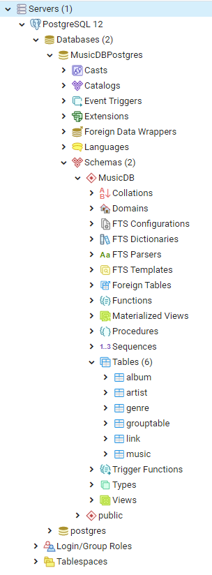

# Progetto per l'esame di Tecnologie per le Basi di Dati

## Introduzione
Questo progetto vuole essere una prima versione di un sito che gestisce un database di musica. \
L'utente può visualizzare, inserire, modificare ed eliminare le seguenti entità:
- Canzoni (Music)
- Album (Album)
- Artisti (Artist)
- Gruppi musicali (Group)
- Generi musicali (Genre)
- Link alle canzoni (Link)
## Interazione con l'utente
Il progetto sviluppato è sia un backend ReST che un frontend basato su template [Thymeleaf](https://www.thymeleaf.org/). \
Esso si basa sul progetto sviluppato per l'esame di Progetto di Sistemi Web, ma è stato largamente
modificato. Il progetto originale conteneva una sola tabella (Music) ed era diviso in una parte di
backend ReST e da una parte di frontend sviluppata con AngularJS. \
Inoltre, esso era stato pensato per lavorare esclusivamente con la rappresentazione dei dati JSON,
mentre il progetto per l'esame di Tecnologie per le Basi di Dati è stato creato in modo da trasferire
le informazioni tramite HTML (oltre che per la rappresentazione dei dati, i parametri passati
dall'utente vengono trasmessi in formato urlencoded.)

## Database
### Introduzione
Il database utilizzato è [PostgreSQL](https://www.postgresql.org/) v12.3.\
La struttura del database che si è scelto di creare è la seguente: \
 \
La gerarchia è quindi: \
Server PostgreSQL > Istanza > Database "MusicDBPostgres" > Schema "MusicDB" >
Tabelle (album, artist, genre, grouptable, link, music).
### Schema ER
Lo schema relazionale del database è il seguente: \
 \
Nota: I nomi in grassetto indicano attributi NOT NULL, le chiavi indicano le chiavi primarie,
le frecce blu indicano chiavi esterne (REFERENCES).
### Connessione al DB
La connessione al database viene effettuata tramite JDBC. Una stringa che permette di collegarsi
al database è la seguente:

    jdbc:postgresql://localhost:5432/MusicDBPostgres?currentSchema=MusicDB
#### Altre note
La query corrispondente alla richiesta <code>GET /music</code> supporta la paginazione dei risultati, e
presuppone che la prima pagina sia indicata con '0' (che è anche il valore di default, nel caso non sia
specificata). La richiesta con specificazione della pagina avrà quindi la seguente forma:

    GET localhost:8080/music?page=<page>

## Richieste possibili
Le richieste che si possono effettuare tramite questo progetto sono mostrate dal menu del sito,
sempre presente in alto.
 \
Per ulteriori dettagli si può consultare il file PostgreSQLImpl.java, dove si può anche vedere il
codice delle query che sono state implementate.

## Dipendenze

    SparkJava Framework --> Framework utilizzato
    PostgreSQL --> Per il database
    SLF4J-API/-SIMPLE --> Per il logging
    Apache HttpComponents --> Per le costanti che rappresentano gli stati HTTP
    JAX WS-RS --> Per le costanti che rappresentano i Media Type
    Guava --> Metodi I/O per fornire l'iconcina "favicon.ico"
    
Per la versione delle dipendenze utilizzate consultare il file build.gradle.